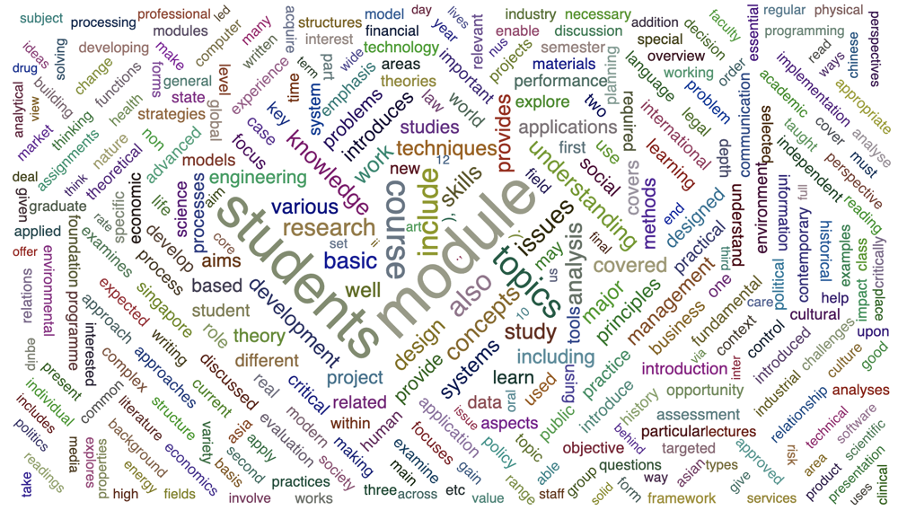
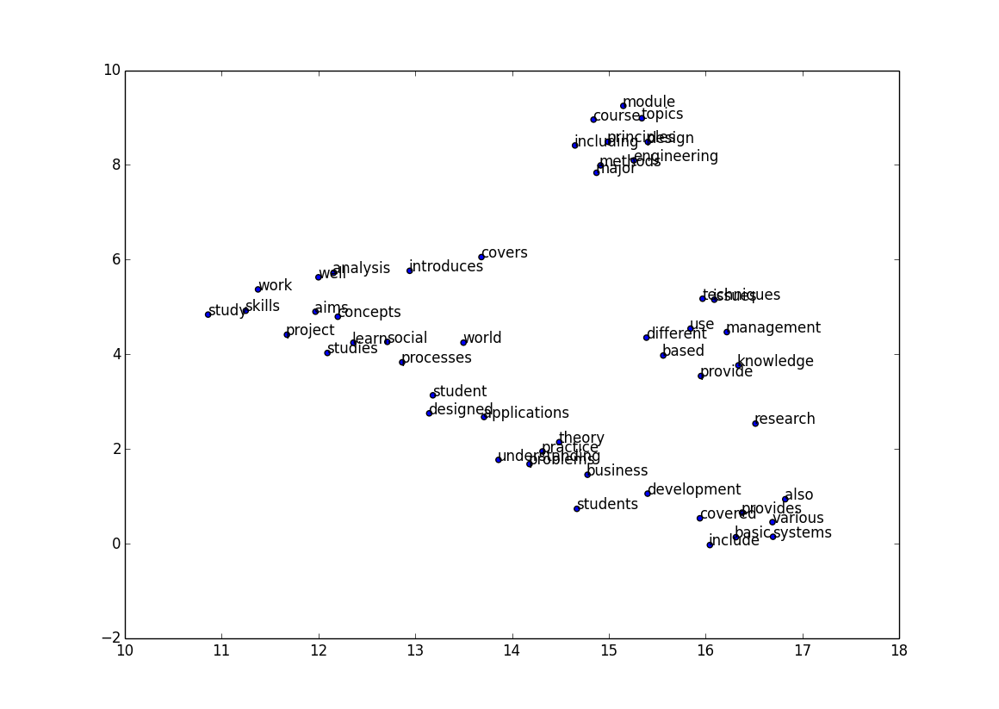
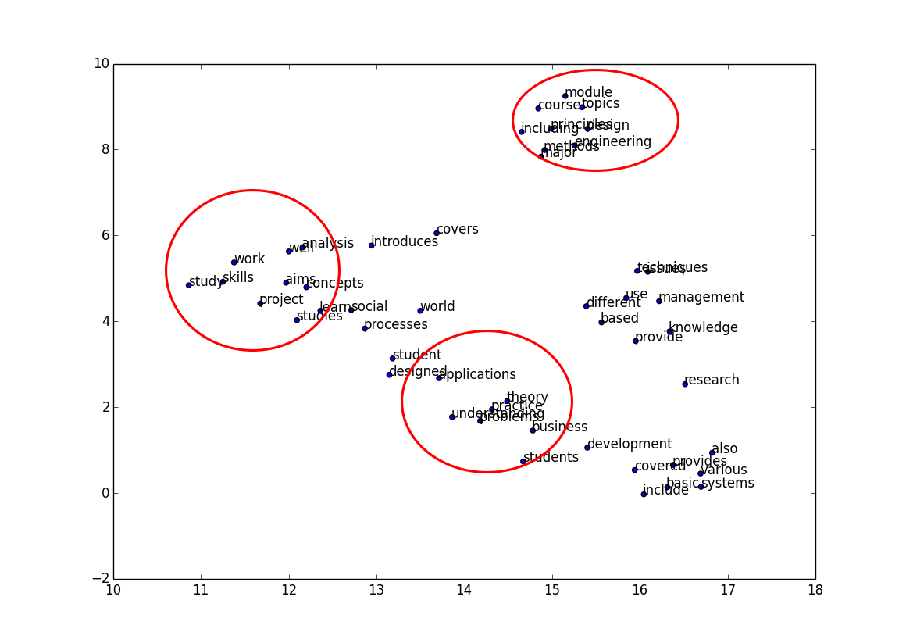
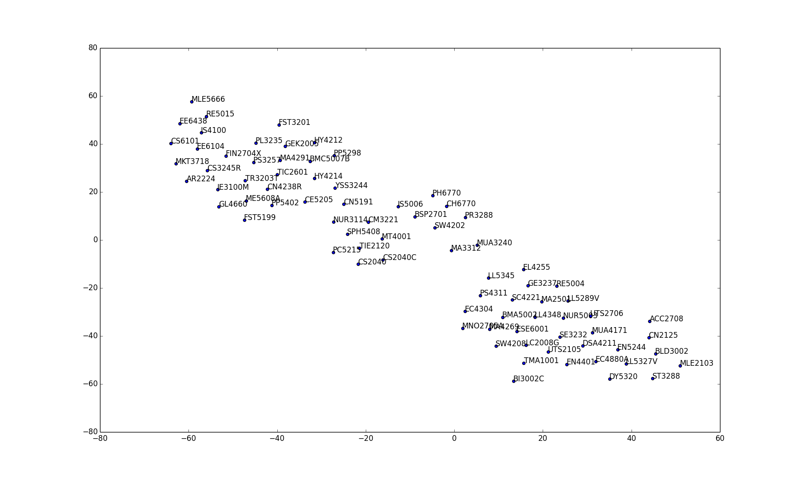
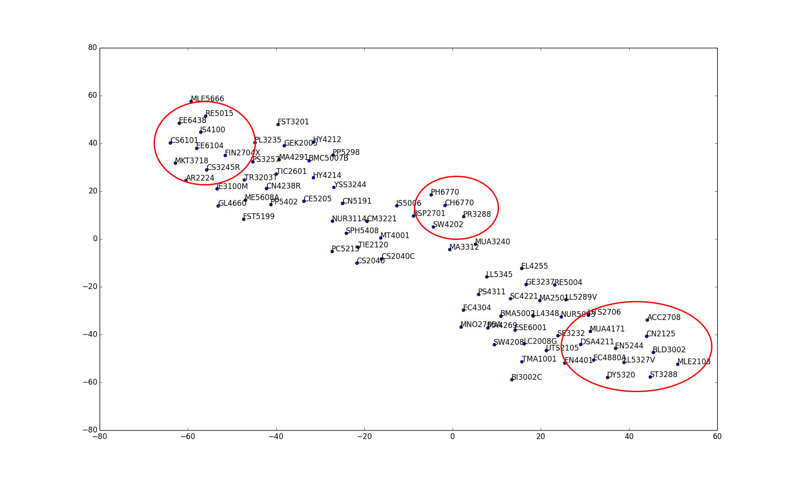

# SimilarCourseVisual
### Description
**For WING's task one**. Crawl some courses codes and descriptions from *NUSmodules*.  Take the descriptions and encode them into thought or doc vectors via word embeddings).  Give a visualization on how the courses relate to each other. 

### File Structure
SimilarCourseVisual/   
|-- bin/　 <small>*(Executable files for the project)*</small>  
|　 |-- \__init__  
|　 |-- data_prepare.py　 <small>*(Crawl and store data to local file)*</small>     
|　 |-- start.py　 <small>*(Starting program)*</small>     
|-- core/　 <small>*(Store all source code for the project (core code))*</small>   
|　 |-- tests/　 <small>*(Store unit test code)*</small>     
|　 |　 |-- __init__.py   
|　 |　 |-- test.main.py     
|　 |-- __init__.py     
|　 |-- test_main.py　 <small>*(Store core logic)*</small>       
|-- conf/　 <small>*(Configuration file)*</small>     
|　 |-- __init__.py     
|　 |-- setting.py　 <small>*(Write the relevant configuration)*</small>       
|---db/    #Database files     
|　 |--db.json　 <small>*(Store database files)*</small>       
|-- docs/　 <small>*(Store some documents)*</small>       
|-- lib/　 <small>*(Library files, put custom modules and packages)*</small>       
|　 |-- __init__.py     
|　 |-- common.py　 <small>*(Write commonly used functions)*</small>       
|-- log/　 <small>*(Log files)*</small>       
|　 |-- access.log　 <small>*(logs)*</small>       
|-- README　 <small>*(Project description document)*</small>

### Data Structure
table **Modsinfo** (  
         **ModsID** int,  
         **ModsCode** text,  
         **ModsDetails** text)  
Mainly covers: Modsid: the Unique identifier in the database; ModsCode: Nus course code; ModsDetails: the descriptions of each module

## How to use
### Prepare data
run data_prepare.py, which will call the function in the `core` to crawl information and store them into db.sqlite3.
 
```bash
python data_prepare.py
```  

`python /bin/start.py`  
Directly draw the word frequency in WordCloud, and save it in /doc
Meanwhile plot the relationships of `RANDOM_SAMPLE_NUM` modules  

`draw_top_frequency(all_keywords_list)`  
*Also call this function to draw the relationship between words and words*

**Modify global variables directly in the lib**  
`STOPWORD_LOCATION` = "../docs/Foxstoplist.txt"   
`DB_LOCATION` = "../db/db.sqlite3"   
`MODEL_LOCATION` = "../db/word\_embedding_corpus"   
`MODEL2_LOCATION` = "../db/keyword\_embedding_corpus"   
`CONSTANT_DB_PATH` = "../db/db.sqlite3"   
`MAIN_FUNCTION_PATH` = "../core/main.py"   

`CONSTANT_DOMAIN` = "http://api.nusmods.com/"

<small>*Random sampling number*</small>  
`RANDOM_SAMPLING_NUM` = 100   
<small>*The number of points shown in the figure*</small>  
`SHOW_WORD_NUM` = 100

**interfaces to DB: class ModsDB**  
`def store_to_sqlite(self, id, code, details)`  
`def read_all_from_sqlite(self)`  
`def read_details_bycode(self, code)`  
`def if_module_exist(self, code)`  
`def create_database(self)`  

**Unit test store at /core/test/**   
Details by reading `test.ipynb`

## Process
### Grab information from the server
- Using`save_code_description(year1, year2, semester)`to crawl course information online  

```python  
def open_url(url):
    '''
    Get the pakage from given url. Camouflage man-made behavior
    :param url: http://...
    :return: response
    '''
    logging.info('Holden: Try to get the pakage from' + url)
    req = urllib2.Request(url)

    req.add_header('User-Agent','Mozilla/5.0 (Macintosh; Intel Mac OS X 10_11_6) AppleWebKit/537.36 (KHTML, like Gecko) Chrome/50.0.2661.75 Safari/537.36 QQBrowser/4.1.4132.400')
    response = urllib2.urlopen(req)

    logging.info('Holden: Successully get the pakage from url')
    return response.read()  
```  
Camouflage man-made behavior by using add_header
Put the data in memory in the form of Json
- Using `ModsDB.store_to_sqlite(self, id, code, details)` to store ID, modules code and modules description one by one.

### Create a handle to the database
`mods_db = ModsDB(DB_LOCATION)`  
Which defined by the class in /core/mods_db.py

### Take all the data from the database for training
`all_classcode_list, all_keywords_list = keywords_list_from_db(mods_db)`  
Extract the keywords for each course introduction and return with the course code. Using Rapid Automatic Keyword Extraction algorithm (RAKE)  
```python
r = Rake()
r.extract_keywords_from_text(modules_db[row][2])
```
### Take random modules to show
For the convenience of display, randomly select 100 samples to draw on the icon. In order to reflect the effect of clustering, random sampling from the database  
`sample_classcode_list, sample_keywords_list = random_keywords_list_from_db(mods_db)`
Using random shuffle

```python
random_arr = np.arange(len(classcode_list))
np.random.shuffle(random_arr)
```
### Word embedding or Load model
Convert all word lists into word vectors using word2vec. And save the model to local path.
If there is trained model in the workspace, then load it directly instead.  

```python
    if os.path.exists(MODEL2_LOCATION):
        model = Word2Vec.load(MODEL2_LOCATION)  # Load trained model
    else:
        model = build_model(all_keywords_list)  # Training data from scratch, embedding words
```
### Draw frequency of words in corpus
`draw_top_frequency(all_keywords_list)`  
Use all keywords from corpus to count their frequencies. Show the most frequently appearing 1000 words by using WordCloud and pyecharts. And try to use plotting bitmaps to show the connection between words and words.

```python
corpus = build_corpus(keywords_list)  # A word counter including all keywords
draw_word_count(corpus)
```
Build corpus containing the frequency of occurrence of each word.

Store the 100 words with the highest frequency and their Vec

```python
words_list, words_vectors = word_and_vec_list(corpus)
plot_tsne2d(words_vectors, words_list)
```

We can see that modules such as [ *'modules'* , *'courses'* , *'topics'* , *'major'* ] and [ *'work'* , *'study'* , *'skills'* , *'project'* ] and [ *'applications'* , *'practice'* , *'problems'* ] etc. are grouped together, meaning that they have very similar positions in the description.


### Draw modules'relationship
The idea is to average the vectors of the keywords that introduce the text in each course. Get the approximate position of the course in the vector space, and then map it to the two-dimensional space and draw it out.

```draw_modules_relation(sample_keywords_list, sample_classcode_list)```  
Because the number of courses is too large, it is not well observed in the chart, so it is randomly sampled from the sample.

```python
def draw_modules_relation(keywords_list,classcode_list):
    '''
    Draw the modules'relationships based on the entire corpus, and draw plot of them
    :param keywords_list: [["word",],]
    :param classcode_list: ["CS5242",]
    :return: Draw plot
    '''
    classvec_by_class_list = word2vec_by_class(keywords_list)
    classvec_list = mean_class_vec_list(classvec_by_class_list)

    plot_tsne2d(classvec_list, classcode_list)
    logging.info('Holden: Finish drawing class relationship')
    return
```

Function ```word2vec_by_class``` is to convert the descriptions of each module into corresponding vectors and save them into the ```classvec_by_class_list```


And it can be found that:  
- **EE**(Electrical and Computer Engineering), **CS**(Computer science), **IS**(Information systems and Analytics), which are closely related to computers are gathered together.  
- **CN**(Chinese study), **SW**(Social work), **PH**(Philosophy). These liberal arts majors are gathered together.  
- **ST**(Statistics and Applied Probability), **EC**(Economics), **AC**(Accounting), that are closely related to statistics are gathered together.  


## Reference
[1] Fox, Christopher. A stop list for general text[J]. ACM SIGIR Forum, 1989, 24(1-2):19-21.  
[2] Stuart J , Engel, David W , et al. Automatic Keyword Extraction from Individual Documents[M]// Text Mining: Applications and Theory. John Wiley & Sons, Ltd, 2010.
